# Spark_Group_project

# Spark_group_project 

 <ul><li>It is a group project done by prateek pudasainee and ujjwal khadka in spark using pyspark apis . We have 13 questions in total and the screenshots of their results posted in readme.</li>
<li>You can run this by installing the requirements .txt folder after cloning the repository </li></ul>  

Here are the questions and  the screenshots: 

### Prateek

#### Calculate the total export value for each country in the table. Show the top 10 countries with the highest total export values.
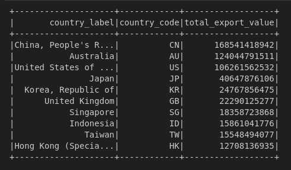

####  Find the year-month and the name of the good which has been least imported. Show bottom 5 . 
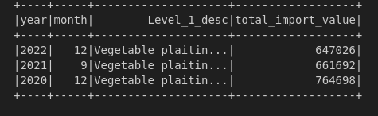

#### Calculate the moving average of the total transactions quarter yearly for each year . 
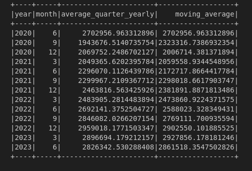

#### Create an udf to find the trade deficit percent with each  country for  this dataset of new zealand
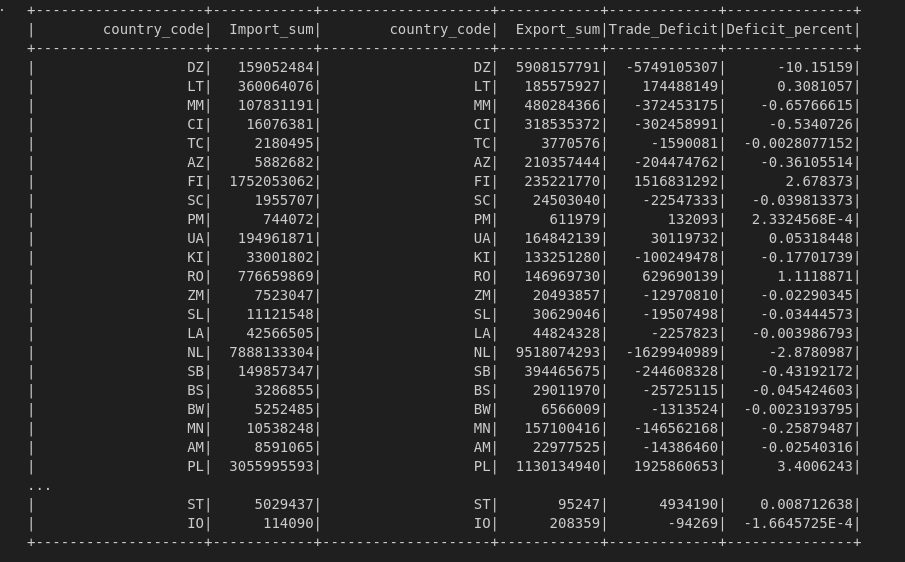

#### calculate the average transactions of imports and exports in a year combined in a table and show it in columns. 
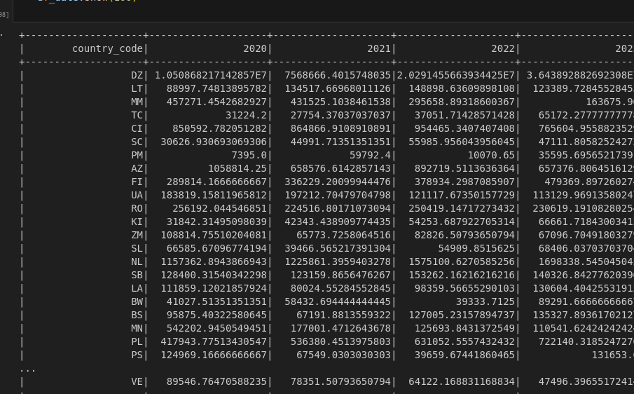

#### Find out which service  each country has imported the most from new zealand. 
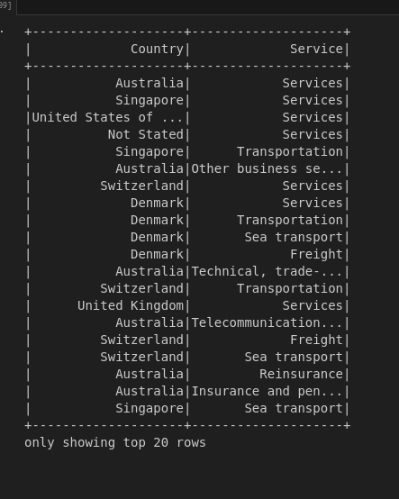

#### Find out which  good is related to animal product or not , and find out how many number of transactions(both import and export) of animal related products and non-animal related products
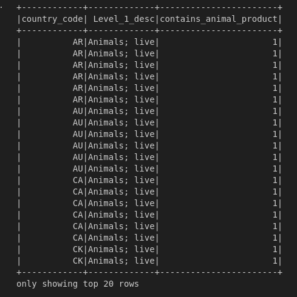

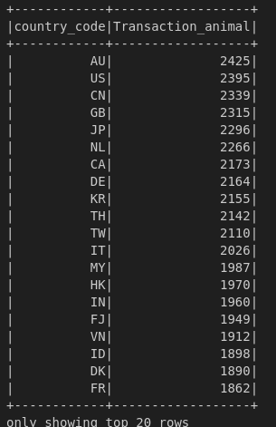

### ujjwal

#### Generate a pivot table that shows the total import values of Services for the top 4
importing countries in June 2023, "Transportation" service categories as columns.

#### .Analyze the total import value of "Services" for each country in June 2023-06-30, and
rank the countries in descending order of import value.
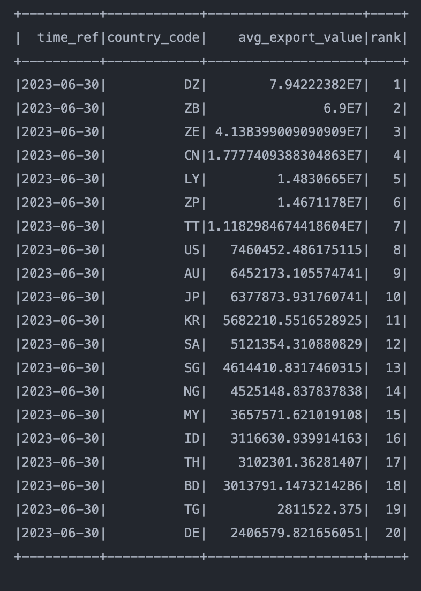

#### Quantify the supreme 20 countries with the highest average export value of "Goods"
#### for each month in the updated time_ref (2023-06-30). Use window functions to calculate
#### the average and rank the countries accordingly
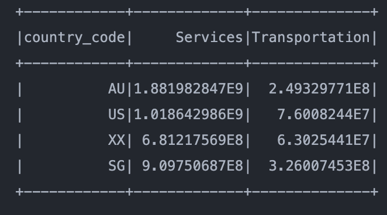

#### Computing the total import value for each country in the 'revised_final' table &
#### presenting the peak 10 countries with the highest total export values.

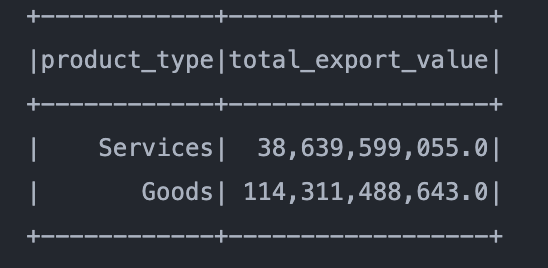

#### Compute the total export value for each product type i.e 'Goods & Services' in the
#### "revised_csv" file for the June 2023 quarter using a UDF.

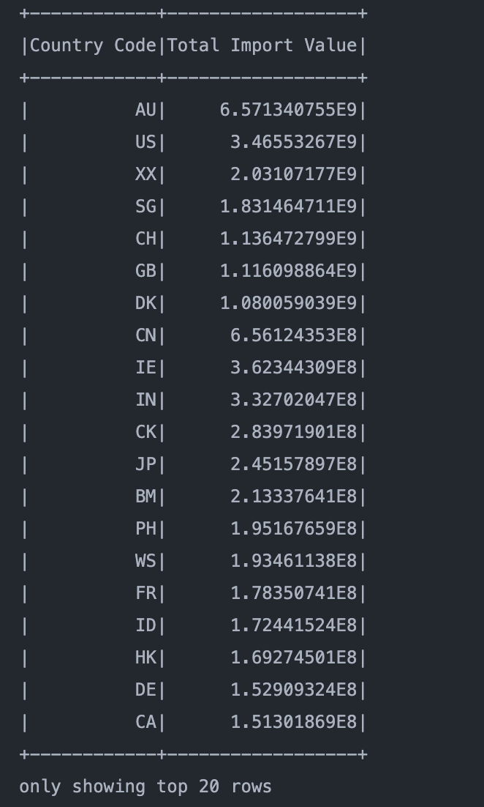

#### Identify countries where the export value for 'Financial Services' exceeds the import
### value for 'Financial Services' in 2023-06-30. Implement a UDF for this comparison.
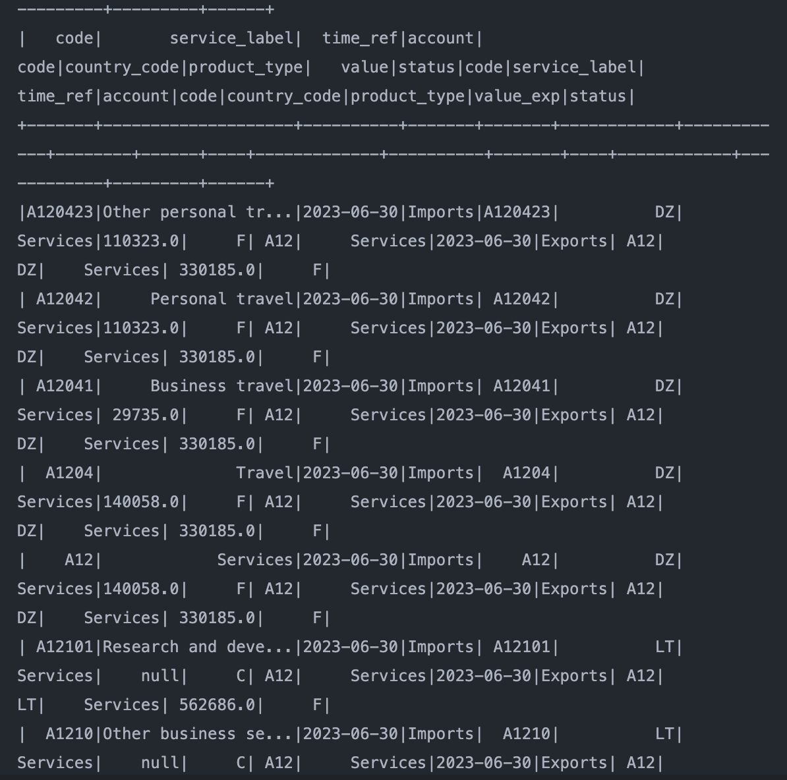
